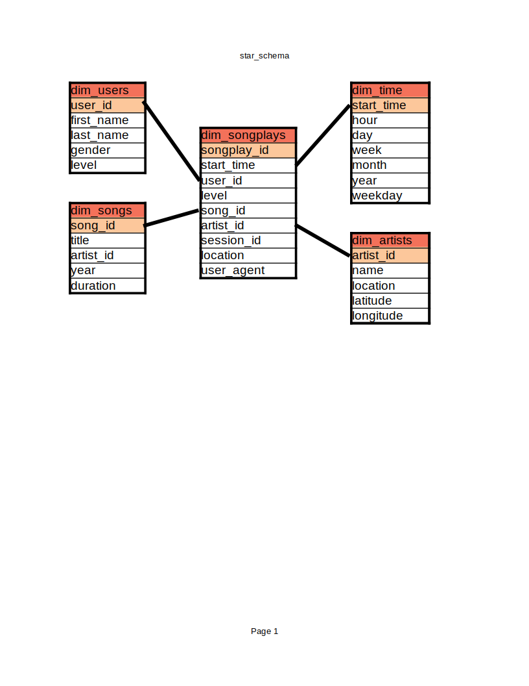

# Project 03: Data Warehouse

Author: Ryan Anstotz

## Background

A music streaming startup, Sparkify, has grown their user base and song database and want to move their processes and data onto the cloud. Their data resides in S3, in a directory of JSON logs on user activity on the app, as well as a directory with JSON metadata on the songs in their app.

As their data engineer, you are tasked with building an ETL pipeline that extracts their data from S3, stages them in Redshift, and transforms data into a set of dimensional tables for their analytics team to continue finding insights in what songs their users are listening to. You'll be able to test your database and ETL pipeline by running queries given to you by the analytics team from Sparkify and compare your results with their expected results.

## Summary

This project required applying knowledge regarding data warehouses and AWS to build an ETL pipeline for a database hosted on Redshift. Data was loaded from S3 to staging tables on Redshift. Then SQL statements were executed to create the analytics tables in a star schema from the staging tables.

## Technical Information

To begin, the AWS services required were designed as infrastructure as code (IaC) as seen in the `./src/aws` folder. Three IaC Python scripts were created to ease the management of the infrastructure. Additionally, a configuration file was created, and not committed to the repository, to manage the credentials for the infrastructure. The first script, `cluster_status.py` would return the status of the cluster noted in the config file. The second, `create_cluster.py` generates the specified cluster in Redshift and creates the IAM roles required for management. Lastly, `delete_cluster.py` deletes all of the resources.

After the infrastructure could be reliably produced, maintained, and cleaned up, the S3 bucket copy queries were created. These queries copied the requisite data from S3 into two staging tables: staging_events and staging_songs. These tables would be used to populate the remaining tables.

Once the staging tables were in place, the analytic tables needed to be designed and implemented through a star schema. Below is the star schema diagram to show the relationships between the data:

After the schema was designed, the ETL process could begin in the `./src/etc` directory. All queries required were placed inside `sql_queries.py`. Next, `create_tables.py` was implemented to generate all necessary tables. Note that this script, along with the others, were implemented piece-meal to create and populate the staging tables first, then for the analytic tables. Next, `etl.py` was used to insert all of the data from the staging tables into the analytics tables. the `DISTINCT` keyword was used to prevent duplicates. Additionally, there was a check to ensure the table primary key was `NOT NULL`.

Lastly, to check the integrity of the data, simple queries were used to understand the expected format and count of data such as `SELECT * FROM any_table LIMIT 10` and `SELECT count (*) FROM any_table`.

Future steps for the project would be to understand the anticipated analytic queries for the tables and use distribution and sorting keys to increase the analytic query time and efficiency.
